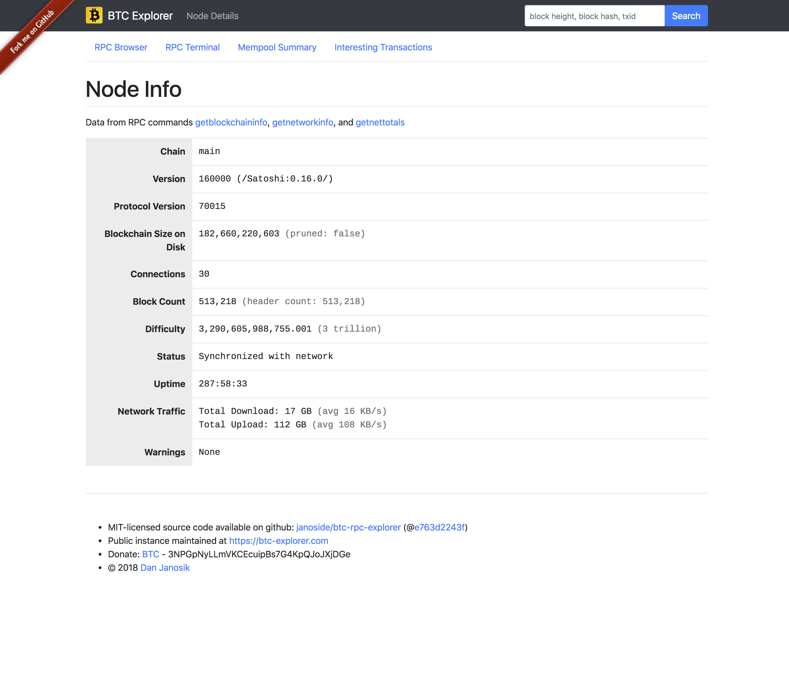
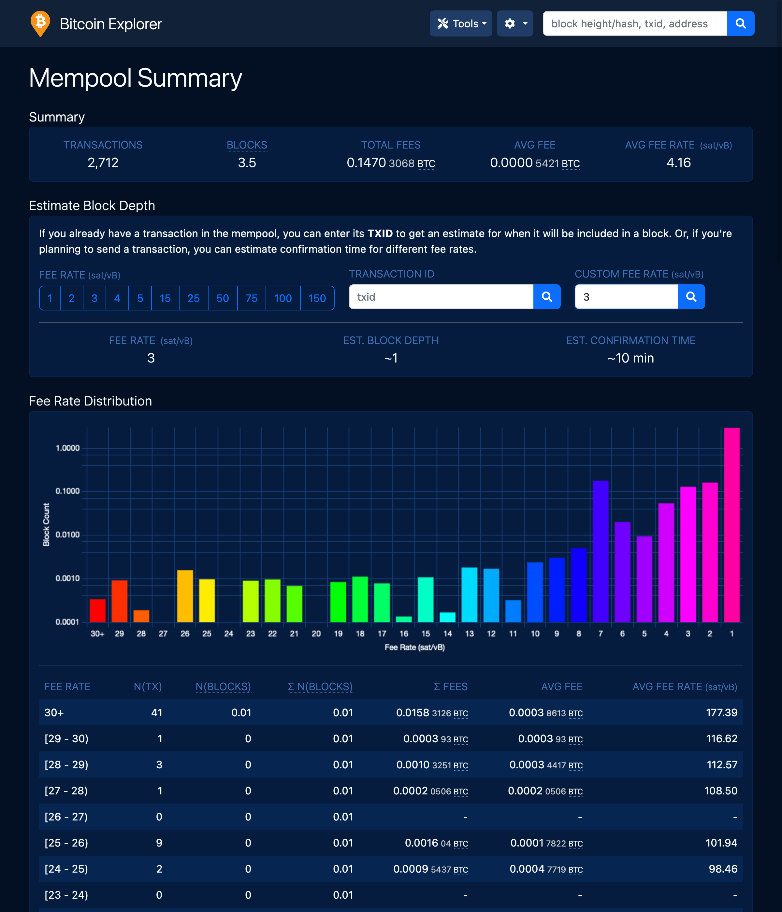
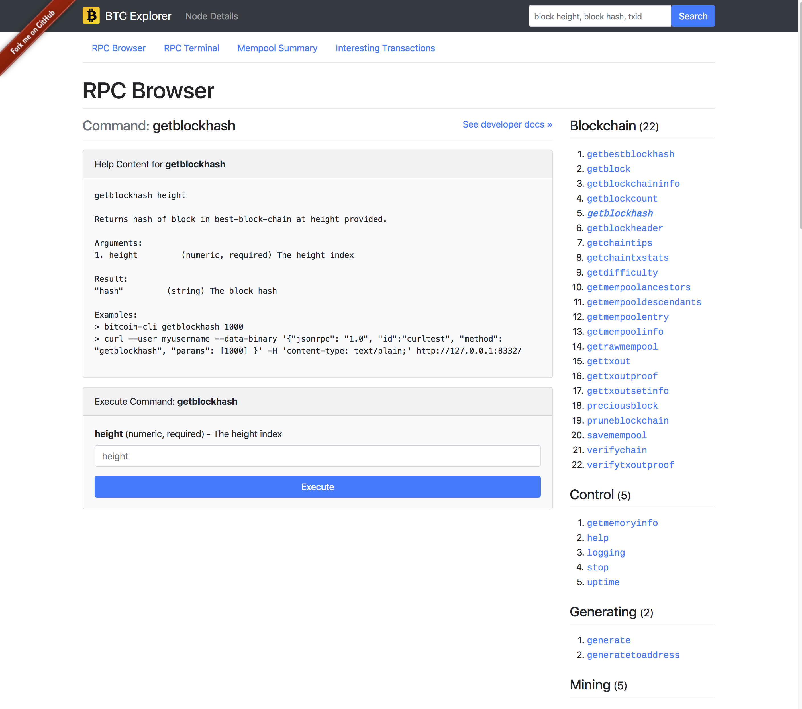

# BTC RPC Explorer

Simple, database-free Bitcoin blockchain explorer, via RPC. Built with Node.js, express, bootstrap-v4.

This tool is intended to be a simple, self-hosted explorer for the Bitcoin blockchain, driven by RPC calls to your own bitcoind node. This tool is easy to run but lacks features compared to full-fledged (database-backed) explorers.

I built this tool because I wanted to use it myself. Whatever reasons one might have for running a full node (trustlessness, technical curiosity, supporting the network, etc) it's helpful to appreciate the "fullness" of your node. With this explorer, you can not only explore the blockchain (in the traditional sense of the term "explorer"), but also explore the functional capabilities of your own node.

Live demos are available at:

* BTC: https://btc.chaintools.io
* LTC: https://ltc.chaintools.io

# Features

* List of recent blocks
* Browse blocks by height, in ascending or descending order
* View block details
* View transaction details, with navigation "backward" via spent transaction outputs
* View raw JSON output used to generate most pages
* Search to directly navigate to transactions or blocks
* Mempool summary, showing unconfirmed transaction counts by fee level
* RPC Browser to explore all of the RPC commands available from your node
* RPC Terminal to send commands to your node
* Currently supports BTC, LTC (support for any Bitcoin-RPC-protocol-compliant coin can be added easily)

# Getting started

The below instructions are geared toward BTC, but can be adapted easily to other coins.

## Prerequisites

1. Install and run a full, archiving node - [instructions](https://bitcoin.org/en/full-node). Ensure that your node has full transaction indexing enabled (`txindex=1`) and the RPC server enabled (`server=1`).
2. Synchronize your node with the Bitcoin network.

## Instructions

1. Clone this repo
2. `npm install` to install all required dependencies
3. Edit the "rpc" settings in [env.js](app/env.js) to target your node
4. Optional: Change the "coin" value in [env.js](app/env.js). Currently supported values are "BTC" and "LTC".
5. `npm start` to start the local server
6. Visit http://127.0.0.1:3002/

# Screenshots

<table>
  <tr>
    <td valign="top">
      <h4>Connect via RPC</h4>
      

      
    </td>
    <td valign="top">
      <h4>Homepage (list of recent blocks)</h4>
      

      
    </td>
    <td valign="top">
      <h4>Node Details</h4>
      

      
    </td>
  </tr>
  <tr>
    <td valign="top">
      <h4>Browse Blocks</h4>
      

      
    </td>
    <td valign="top">
      <h4>Block Details</h4>
      

      
    </td>
    <td valign="top">
      <h4>Mempool Summary</h4>
      

      
    </td>
  </tr>
  <tr>
    <td valign="top">
      <h4>Transaction Details</h4>
      

      
    </td>
    <td valign="top">
      <h4>Transaction, Raw JSON</h4>
      

      
    </td>
    <td valign="top">
      <h4>RPC Browser</h4>
      

      
    </td>
  </tr>
</table>

# Donate

To support continued development of this tool and/or to support the hosting of the live demo site:

* [Bitcoin](bitcoin:3NPGpNyLLmVKCEcuipBs7G4KpQJoJXjDGe): 3NPGpNyLLmVKCEcuipBs7G4KpQJoJXjDGe
* [Litecoin](litecoin:ME4pXiXuWfEi1ANBDo9irUJVcZBhsTx14i): ME4pXiXuWfEi1ANBDo9irUJVcZBhsTx14i

