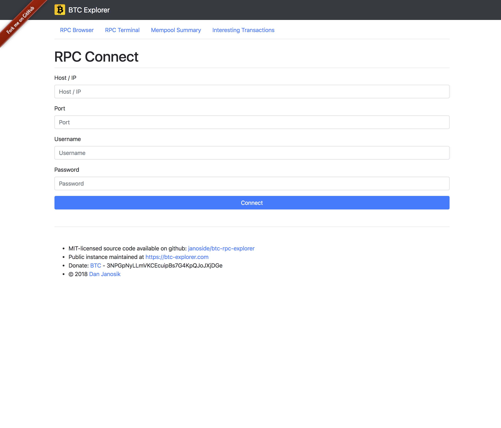
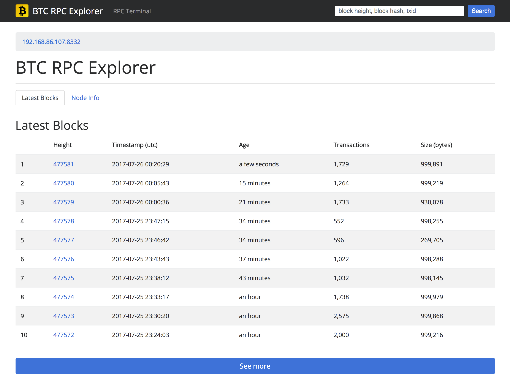
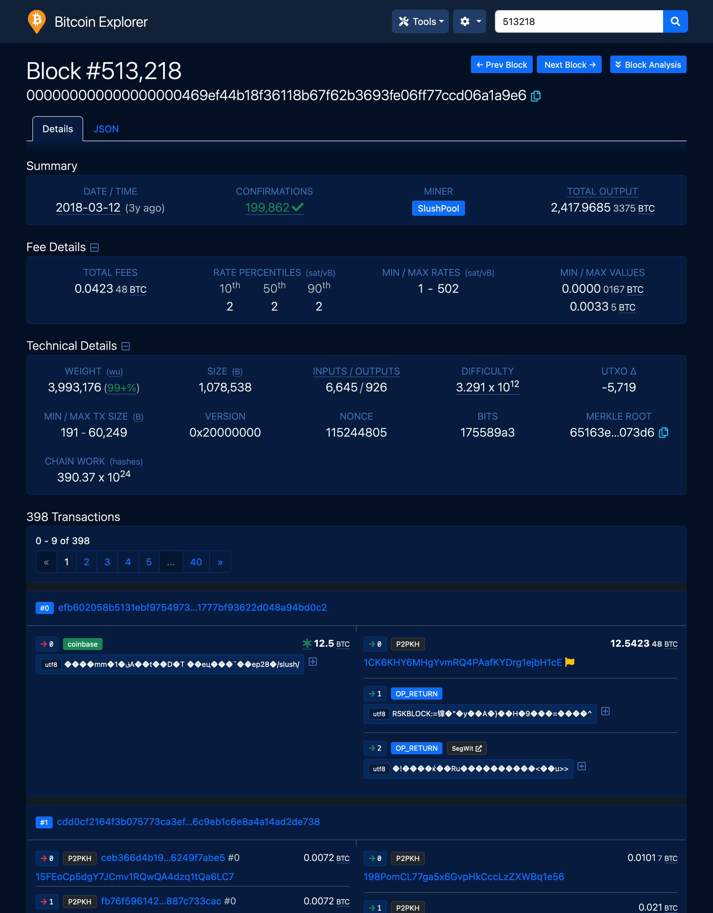
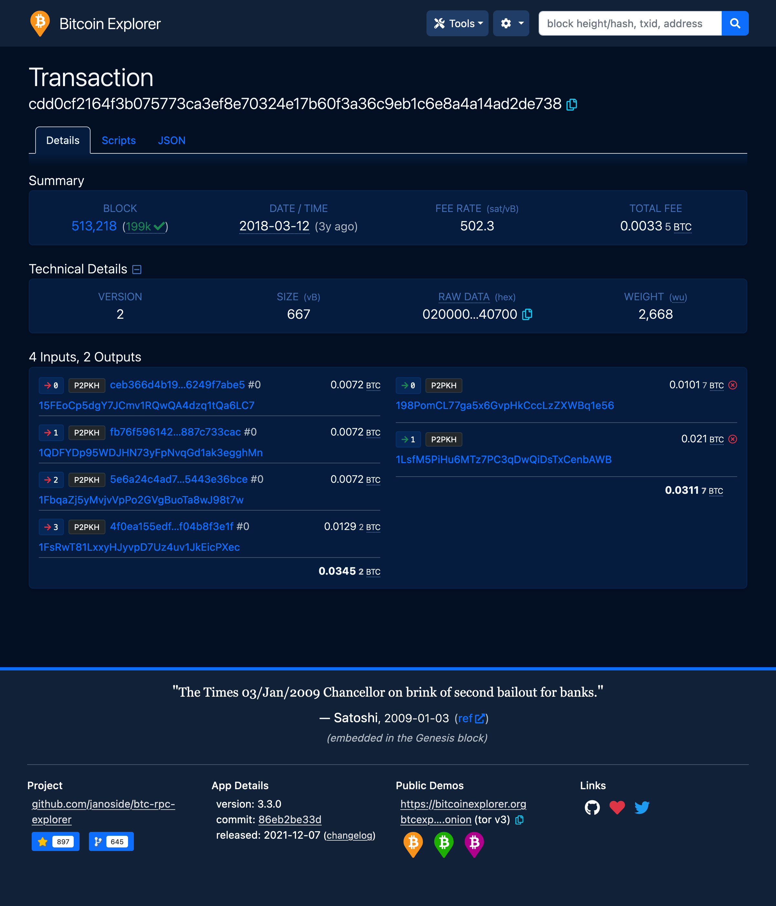
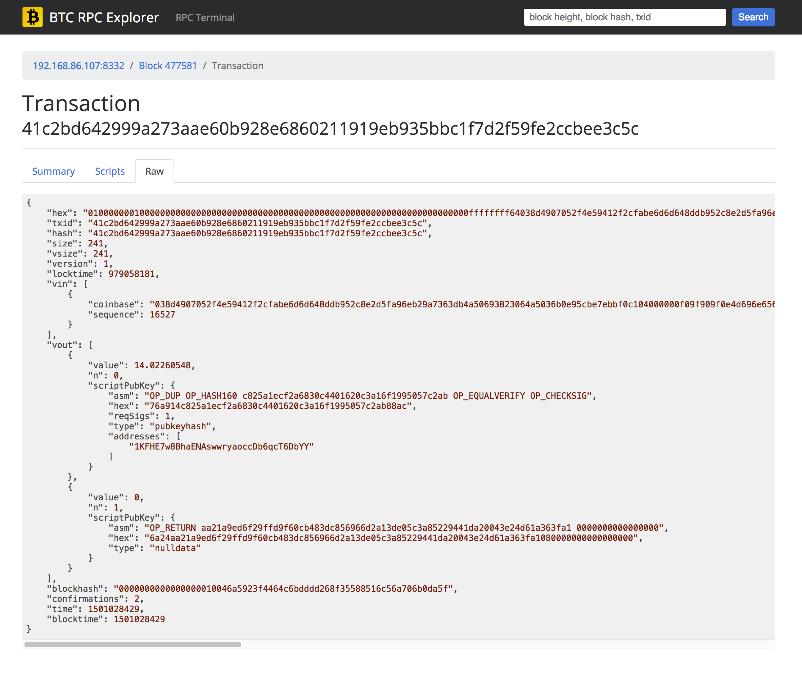
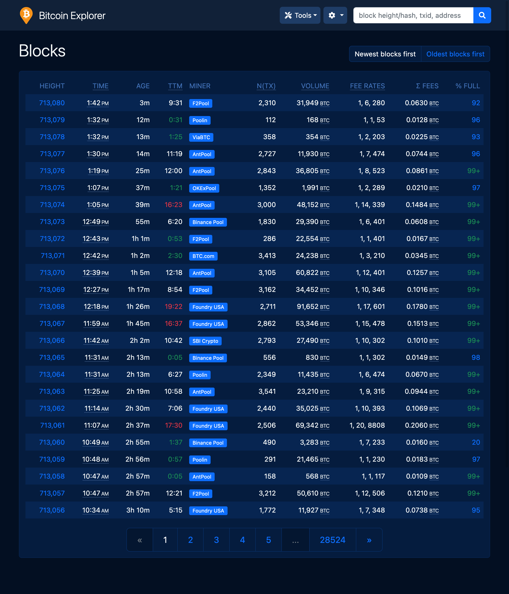

# 

# BTC RPC Explorer

Simple, stateless Bitcoin blockchain explorer, via RPC. Build with Node.js, express, bootstrap-v4.

This tool is intended to be a simple, stateless, self-hosted explorer for the Bitcoin blockchain, driven by RPC calls to your own bitcoind node. Because it is stateless, it is easy to run but lacks some (many?) of the features of other explorers.

# Getting started

## Prerequisites

1. Install and run a full, archiving node - [instructions](https://bitcoin.org/en/full-node). Ensure that your node has full transaction indexing enabled (`txindex=1`) and the RPC server enabled (`server=1`).
2. Synchronize your node with the Bitcoin network.

## Instructions

1. Clone this repo
2. `npm install` to install all required dependencies
3. Optional: Uncomment the "bitcoind" section in [env.js](app/env.js) to automatically connect to the target node.
4. `npm start` to start the local server
5. Navigate to http://127.0.0.1:3002/
6. Connect using the RPC credentials for your target bitcoin node (if you didn't edit [env.js](app/env.js) in Step 3)

# Screenshots

### Connect via RPC
# 

### Homepage (list of recent blocks)
# 

### Block Details
# 

### Transaction Details
# 

### Transaction, Raw JSON
# 

### List of all Blocks
# 
